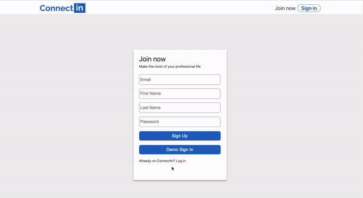
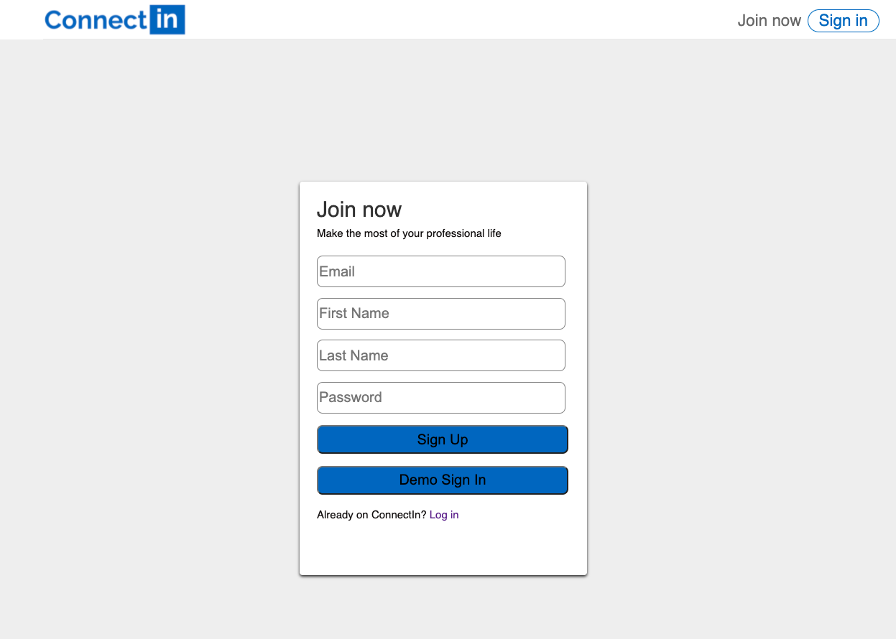
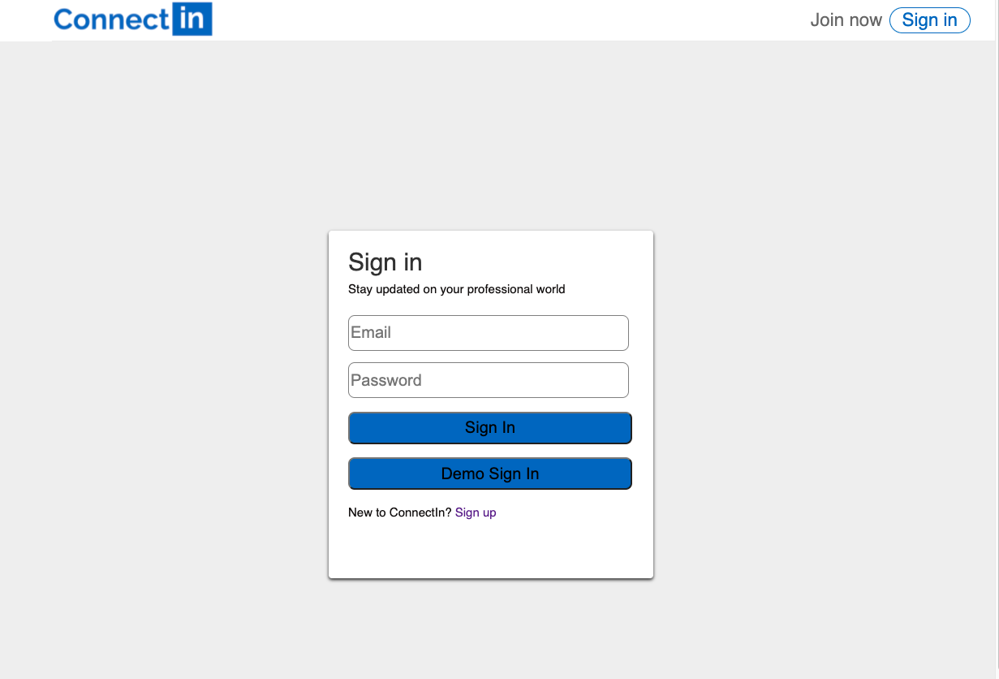
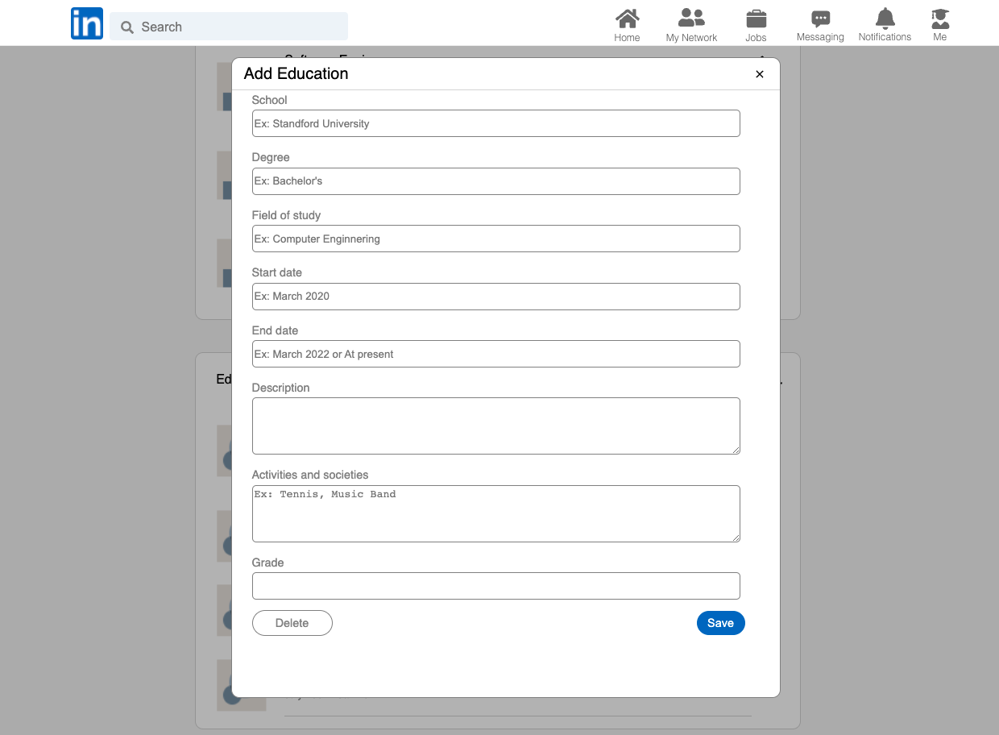
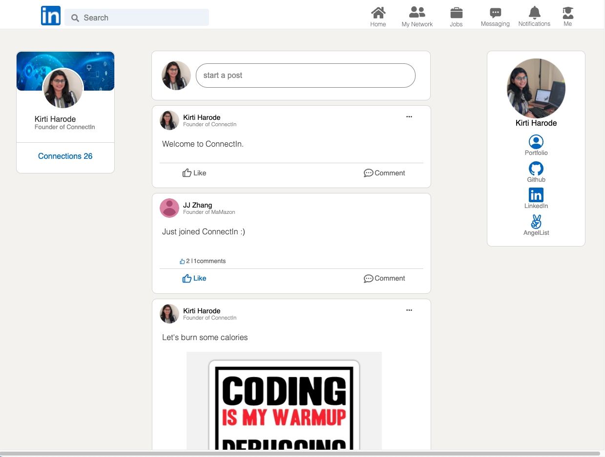
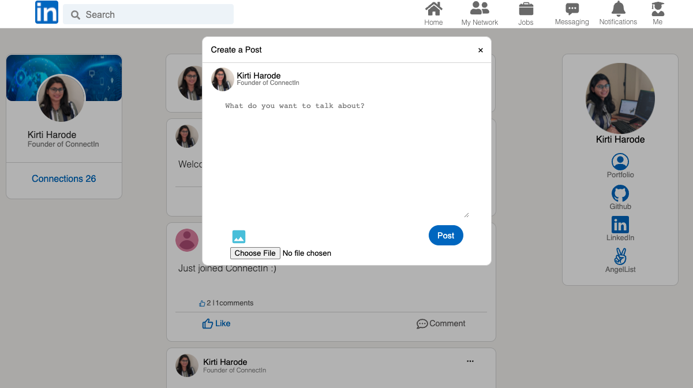
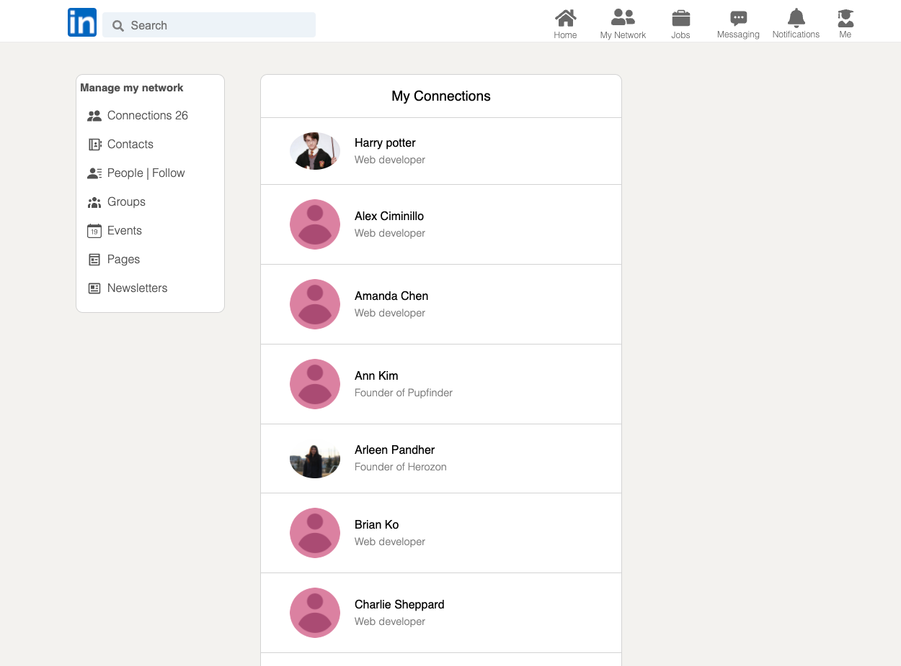

# <p></p>


## About
ConnectIn is a Clone of a professional networking site LinkedIn,In connectIn users can make their profile edit profile information, connect with other users, share posts, and comment/Like each other's posts.


#### Live Site: [ConnectIn](https://connectedin.herokuapp.com/#/)



## Technologies Used
* Frontend: React/Redux
* Backend: Rails
* Style: SCSS
* Database: PostgreSQL
* Image Upload: AWS
* Other: HTML, jQuery, JBuilder, Webpack

## Features

### User Authentication
Users can create an account with basic information. Upon logging-in users have access to additional features such as creating/editing profile, posting/liking a post /commenting on a post, and connecting with other users.






### Profile
On profile page, users can create or edit their user information, about, experience, and education.




### Post
Users can write posts on the live feed page. Other users can see the post and write a comment on it and like the post.




### Network
Users have access to their network.


## Highlights 
  Used modal to create or edit, user profile information and  posts :

```js

const Modal = ({modal, closeModal})  => {
    if (!modal) {
        return null;
    }
    let component;
    switch (modal) {
        case 'editUserIntro':
            component = <UserIntro />
            break;
        case 'createAbout':
            component = <CreateAbout />
            break;
        case 'editAbout':
            component = <EditAbout />
            break;
        case 'createExperience':
            component = <CreateExperience />
            break;
        case 'editExperience':
            component = <EditExperience />
            break;
        case 'createEducation':
            component = <CreateEducation />
            break;
        case 'editEducation':
            component = <EditEducation />
            break;
        case 'createPost':
            component = <CreatePost />
            break;
        case 'editPost':
            component = <EditPost />
            break;
        default:
            return null;
    }
    return (
        <div className="modal-background" onClick={closeModal}>
            <div className="modal-child" onClick={e => e.stopPropagation()}>
                { component }
            </div>
        </div>
    );
}

```
Creating a post and adding images to it : 

```js

 <div className="post-form-div">
                <header className="post-form-header">
                    <div className="form-type-heading">
                        <h1>{this.props.formType}</h1>
                        <div className="post-close-button-div" onClick={()=> this.props.closeModal()}> 
                            <GrFormClose className='post-close-icon'/>
                        </div>
                    </div>
                    <div className="post-user-info-modal">
                        
                        <div className="user-name-bio">
                            <h1>{this.props.currentUser.fname} {this.props.currentUser.lname}</h1>
                            <h2>{this.props.currentUser.bio}</h2>
                        </div>
                    </div>
                </header>

                <div className="post-form-content">
                    <form className="post-form" onSubmit={this.handleSubmit}>
                        <div className="post-textarea-div">
                            <textarea className="post-body-textarea" 
                                placeholder="What do you want to talk about?" 
                                value={this.state.body} onChange={this.updateInput('body')} />
                        </div>

                        <div className="post-media-preview">
                            {media_preview}
                        </div>
                        <div className="post-form-footer">
                            <div className="post-photo-button">
                                <div className="photo-add" onClick={()=> this.openFileLoader}>
                                    <MdPhoto className="add-photo-icon"/>
                                </div>
                                <input type="file" id="post-media" accept='image/*' onChange={this.handleFile} />
                            </div>
                            <button className="post-submit-button" >Post</button>
                        </div>
                    </form>
                </div>
            </div>

```       

Well organized file structure:

```js 

 return(
            <div className="profile-div">
                <section className="user-intro">
                    <IntroContainer />
                </section>
                <section className="about-index-conatiner">
                    <AboutIndexContainer />
                </section>
                <section className="exp-index-conatiner">
                    <ExperienceIndexConatiner />
                </section>
                <section className="edu-index-conatiner">
                    <EducationIndexConatiner />
                </section>
            </div>
        )

```
## Future Implementations
* Messaging utilizing Action Cables
