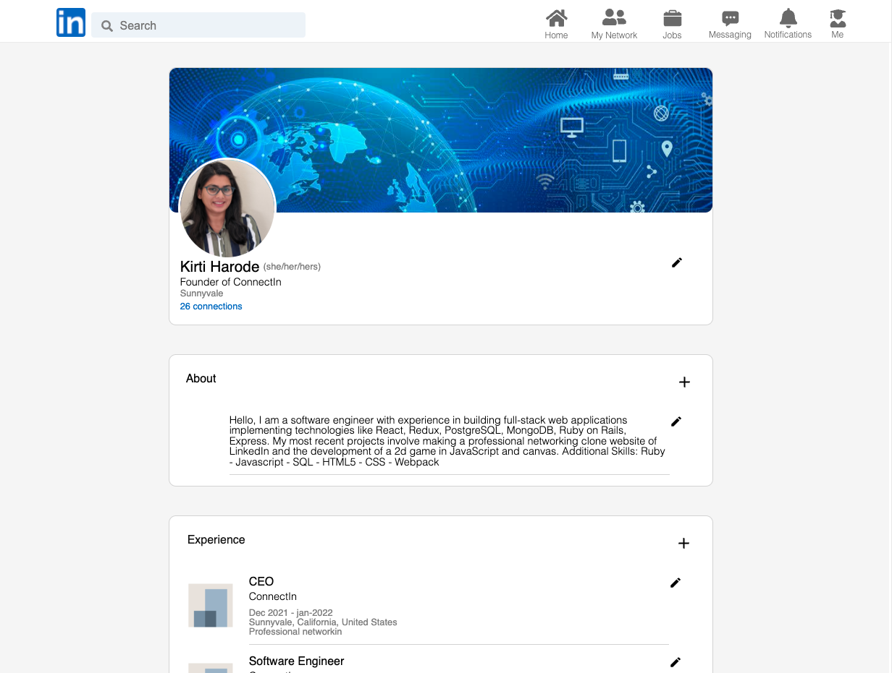

# 

## About
ConnectIn is a Clone of a professional networking site LinkedIn,In connectIn users can make their profile edit profile information, connect with other users, share posts, and comment/Like each other's posts.

#### Live Site: [ConnectIn](https://connectedin.herokuapp.com/#/)

## Technologies Used
* Frontend: React/Redux
* Backend: Rails
* Style: SCSS
* Database: PostgreSQL
* Image Upload: AWS
* Other: HTML, jQuery, JBuilder, Webpack

## Features
### User Authentication
Users can create an account with basic information. Upon logging-in users have access to additional features such as creating/editing profile, posting/like/comment, and connecting with other users.

### Profile
On profile page, users can create or edit their user information, about, experience, and education.

### Post
Users can write posts on the live feed page. Other users can see the post and write a comment on it and like the post.

### Network
Users have access to their network.

## Future Implementations
* Request/accept connections
* Search Bar
